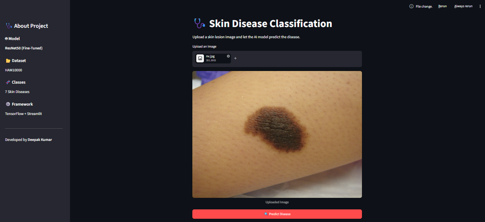
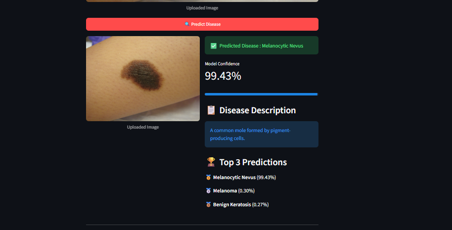
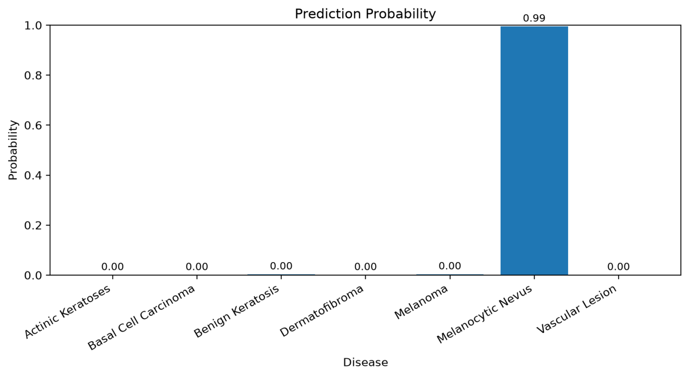

<div align="center">

# 🩺 Skin Disease Classification using Deep Learning

### AI-Powered Skin Disease Classification using Fine-Tuned ResNet50

[](https://www.python.org/)
[](https://www.tensorflow.org/)
[](https://keras.io/)
[](https://streamlit.io/)
[](https://opencv.org/)
[](LICENSE)

**A Deep Learning based Skin Disease Classification System built using Transfer Learning with ResNet50 and deployed using Streamlit.**

</div>

---

# 📖 Table of Contents

* [Project Overview](#-project-overview)
* [Project Highlights](#-project-highlights)
* [Project Pipeline](#-project-pipeline)
* [Dataset](#-dataset)
* [Technology Stack](#-technology-stack)
* [Project Objective](#-project-objective)

---

# 📌 Project Overview

Skin diseases are among the most common health conditions worldwide. Accurate diagnosis often requires experienced dermatologists and specialized equipment, making early detection difficult for many people.

This project presents an **AI-powered Skin Disease Classification System** that automatically classifies dermoscopic skin lesion images into one of seven disease categories using **Deep Learning**.

Instead of relying on a single pretrained model, multiple architectures were trained, evaluated, and compared before selecting the final deployment model. After extensive experimentation, **Fine-Tuned ResNet50** was selected because it provided the best balance between accuracy, stability, and generalization.


---

# ✨ Project Highlights

✔️ End-to-End Deep Learning Project

✔️ Medical Image Classification

✔️ Transfer Learning

✔️ Fine-Tuning

✔️ Model Comparison

✔️ Real-Time Inference

✔️ Streamlit 

✔️ Probability Visualization

✔️ Top-3 Predictions

✔️ Disease Description

✔️ Modular Project Structure

✔️ Production-Ready Inference Pipeline

---

# 🏗️ Project Pipeline

```text
                      HAM10000 Dataset
                              │
                              ▼
                     Exploratory Data Analysis
                              │
                              ▼
                      Data Preprocessing
                              │
                              ▼
                    Image Normalization
                              │
                              ▼
                 Deep Learning Model Training
         ┌──────────────┬──────────────┬──────────────┐
         │              │              │              │
         ▼              ▼              ▼              ▼
    Custom CNN    EfficientNetB0    ResNet50        DesNet121
         │              │              │              │
         └──────────────┴──────────────┘──────────────┘
                        │
                        ▼
                 Model Evaluation
                        │
                        ▼
               Best Model Selection
                        │
                        ▼
                Inference Pipeline
                        │
                        ▼
            Streamlit Web Application
```

---

# 📂 Dataset

## HAM10000 Dataset

**HAM10000 (Human Against Machine with 10,000 Training Images)** is a publicly available dataset containing dermoscopic images of pigmented skin lesions.

The dataset is one of the most widely used benchmarks for skin lesion classification research.

### Number of Classes

| Class Code | Disease              |
| ---------- | -------------------- |
| akiec      | Actinic Keratoses    |
| bcc        | Basal Cell Carcinoma |
| bkl        | Benign Keratosis     |
| df         | Dermatofibroma       |
| mel        | Melanoma             |
| nv         | Melanocytic Nevus    |
| vasc       | Vascular Lesion      |

---

## Dataset Characteristics

* Total Images: **10,015**
* Image Type: Dermoscopic Images
* Number of Classes: **7**
* Image Size (Original): **600 × 450**
* Input Size (Model): **224 × 224**
* Dataset Type: Multi-Class Image Classification

---

# 💻 Technology Stack

| Category             | Technologies             |
| -------------------- | ------------------------ |
| Programming Language | Python                   |
| Deep Learning        | TensorFlow, Keras        |
| Transfer Learning    | ResNet50, EfficientNetB0, DesNet121 |
| Computer Vision      | OpenCV                   |
| Numerical Computing  | NumPy                    |
| Data Visualization   | Matplotlib               |
| Web Framework        | Streamlit                |
| Version Control      | Git & GitHub             |

---

# 🎯 Project Objective

The primary objective of this project is to develop an intelligent image classification system capable of identifying different categories of skin diseases using Deep Learning.

Instead of selecting a pretrained model directly, multiple architectures were trained and compared. The best-performing model was then deployed into a user-friendly web application to simulate a real-world AI inference workflow.

This project demonstrates the complete machine learning lifecycle including:

* Data preprocessing
* Model development
* Transfer learning
* Fine-tuning
* Model evaluation
* Inference pipeline
* Web application deployment

The project focuses not only on achieving good predictive performance but also on building a clean, modular, and production-ready AI application.

---

# 📊 Exploratory Data Analysis (EDA)

Before training the deep learning models, an extensive Exploratory Data Analysis (EDA) was performed to better understand the dataset.

The following analyses were carried out:

* Class distribution analysis
* Image resolution analysis
* Pixel intensity distribution
* Dataset imbalance visualization
* Sample image visualization for each disease class

### Key Observations

* The dataset is **highly imbalanced**.
* **Melanocytic Nevus (nv)** is the dominant class.
* Some classes such as **Dermatofibroma (df)** and **Vascular Lesion (vasc)** contain significantly fewer samples.
* All images have a consistent original resolution of **600 × 450** pixels, making preprocessing straightforward.

Understanding these characteristics was important for selecting an appropriate training strategy.

---

# 🧹 Data Preprocessing

A dedicated preprocessing pipeline was developed before model training.

The preprocessing steps include:

* Image loading using OpenCV
* Conversion from BGR to RGB
* Image resizing to **224 × 224**
* Conversion to NumPy arrays
* ResNet50 preprocessing
* Label encoding
* Train / Validation / Test split

These preprocessing steps ensured that the data matched the input requirements of the pretrained ResNet50 architecture.

---

# 🧠 Model Development

Instead of selecting a pretrained model directly, multiple deep learning architectures were trained and evaluated to identify the most suitable model.

The project followed a progressive experimentation approach.

---

## Phase 1 — Custom CNN

A Convolutional Neural Network was designed and trained from scratch.

The objective of this model was to establish a baseline performance without using transfer learning.

### Result

* Successfully learned basic image features.
* Provided a strong baseline for comparison.
* Lower generalization compared to pretrained architectures.

---

## Phase 2 — EfficientNetB0

EfficientNetB0 was trained using transfer learning.

Initially, the pretrained backbone was frozen and only the classification head was trained.

This significantly improved performance compared to the custom CNN.

An additional fine-tuning experiment was conducted by unfreezing deeper layers.

Although fine-tuning increased the model's capacity, validation performance became less stable. Therefore, this version was not selected for deployment.

---

## Phase 3 — ResNet50

Finally, ResNet50 was selected for experimentation.

The model was trained using transfer learning and later fine-tuned by unfreezing selected layers.

Among all trained models, the fine-tuned ResNet50 achieved the best balance between accuracy, stability, and inference performance.

This model was selected for deployment.

---

# 📈 Model Comparison

| Model          | Training Strategy                   |                    Test Accuracy | Status        |
| -------------- | ----------------------------------- | -------------------------------: | ------------- |
| Custom CNN     | Built From Scratch                  |                       **60.55%** | Baseline      |
| EfficientNetB0 | Feature Extraction                  |                       **72.06%** | Improved      |
| EfficientNetB0 | Fine-Tuning                         | Validation performance decreased | Not Selected  |
| **ResNet50**   | **Transfer Learning + Fine-Tuning** |                       **80.50%** | ✅ Final Model |

---

# 🏆 Why ResNet50?

The final deployment model was selected after comparing multiple architectures.

The decision was based on:

* Higher classification accuracy
* Better validation stability
* Improved generalization
* Reliable inference performance
* Better balance between performance and deployment

Rather than selecting the model with only the highest training accuracy, emphasis was placed on overall performance during evaluation and inference.

---

# 📊 Final Model Performance

## Final Selected Model

**Architecture:** Fine-Tuned ResNet50

| Metric              |                            Value |
| ------------------- | -------------------------------: |
| Training Accuracy   |                       **90.03%** |
| Validation Accuracy |                       **83.62%** |
| Test Accuracy       |                       **80.50%** |

---

# 🔍 Inference Pipeline

Once training was completed, the model was integrated into a dedicated inference pipeline.

The prediction workflow is as follows:

1. User uploads a skin lesion image.
2. The image is resized to **224 × 224**.
3. ResNet50 preprocessing is applied.
4. The trained model predicts class probabilities.
5. The most probable disease is selected.
6. The application displays:

   * Predicted disease
   * Confidence score
   * Top-3 predictions
   * Disease description
   * Probability distribution chart

---

# 💡 Challenges Faced

During the development of this project, several practical challenges were encountered.

Some of the major challenges included:

* Highly imbalanced dataset
* Lower performance of the initial Custom CNN
* Fine-tuning instability in EfficientNetB0
* Selecting the most suitable pretrained architecture
* Building a modular inference pipeline
* Integrating the trained model into a Streamlit application

Addressing these challenges significantly improved both the final model and the deployment workflow.

---

# 📁 Project Structure

```text
SkinDiseaseClassifier/
│
├── app.py                           # Streamlit Web Application
├── inference.py                     # Model Inference Pipeline
├── requirements.txt                 # Project Dependencies
├── README.md                        # Project Documentation
├── .gitignore
│
├── models/
│   ├── README.md
│   └── (Download the trained model here)
│
├── utils/
│   ├── preprocess.py                # Image Preprocessing Functions
│   └── mapping.py                   # Class Labels & Disease Information
│
├── sample_images/
│   ├── sample_1.jpg
│   ├── sample_2.jpg
│   └── sample_3.jpg
│
├── results/
│   ├── app_demo.png
│   ├── prediction.png
│   ├── probability_chart.png
│   └── model_comparison.png
│
└── assets/
```

---

# ⚙️ Installation

Clone the repository

```bash
git clone https://github.com/pal-deepaak/SkinDiseaseClassifier.git
```

Move into the project directory

```bash
cd SkinDiseaseClassifier
```

Create a virtual environment

```bash
python -m venv .venv
```

Activate the virtual environment

### Windows

```bash
.venv\Scripts\activate
```

### Linux / macOS

```bash
source .venv/bin/activate
```

Install the required dependencies

```bash
pip install -r requirements.txt
```

---

# 📥 Download Trained Model

The trained **ResNet50 Fine-Tuned** model is **not included** in this repository because its size exceeds GitHub's file size limit.

Download the model using the link below:

**Google Drive**

```
https://drive.google.com/file/d/1CJSsHiNOnXQl-kmLfROGHfxXXBe6jUD3/view?usp=sharing
```

After downloading, place the model inside the **models** folder.

```text
models/
└── resnet50_finetuned_model.keras
```

---

# ▶️ Running the Application

Launch the Streamlit application

```bash
streamlit run app.py
```

The application will automatically open in your default web browser.

---

# 🚀 Application Workflow

The deployed application follows the workflow below.

```text
Upload Image
      │
      ▼
Image Preprocessing
      │
      ▼
ResNet50 Prediction
      │
      ▼
Probability Calculation
      │
      ▼
Top-3 Predictions
      │
      ▼
Disease Description
      │
      ▼
Prediction Probability Chart
```

---

# 📸 Application Screenshots

## 🏠 Home Page

> Replace the image below with your own screenshot.

```markdown

```

---

## 🔍 Prediction Result

```markdown

```

---

## 📊 Prediction Probability

```markdown

```


```

---

# 🎯 Features of the Web Application

The Streamlit application provides the following features:

* Upload skin lesion images
* Real-time disease prediction
* Prediction confidence score
* Top-3 predicted diseases
* Disease description
* Probability visualization
* Clean and responsive interface
* Educational medical disclaimer

---

# 🧪 Sample Prediction Workflow

1. Upload a dermoscopic skin lesion image.
2. Click **Predict**.
3. The image is preprocessed automatically.
4. The trained ResNet50 model performs inference.
5. The predicted disease is displayed.
6. Confidence score is calculated.
7. Top-3 predictions are shown.
8. Disease description is displayed.
9. Prediction probability graph is generated.

---

# 🛠 Technologies Used

| Category             | Technology         |
| -------------------- | ------------------ |
| Programming Language | Python             |
| Deep Learning        | TensorFlow, Keras  |
| Transfer Learning    | ResNet50           |
| Computer Vision      | OpenCV             |
| Numerical Computing  | NumPy              |
| Visualization        | Matplotlib         |
| Web Framework        | Streamlit          |
| Version Control      | Git & GitHub       |
| IDE                  | Visual Studio Code |

---

# 🚀 Future Improvements

Although the current system provides reliable skin disease classification, there are several enhancements that can further improve the project.

### Explainable AI

* Implement Grad-CAM visualization to highlight the regions influencing the model's prediction.
* Improve model interpretability for better understanding of AI decisions.

### Model Improvements

* Experiment with Vision Transformers (ViT)
* Explore ConvNeXt architectures
* Train larger EfficientNet variants
* Apply Ensemble Learning
* Perform Hyperparameter Optimization

### Deployment Improvements

* Deploy the application on Streamlit Community Cloud
* Containerize the application using Docker
* Deploy REST API using FastAPI
* Add Hugging Face model hosting
* Improve inference speed

### User Experience

* Drag-and-drop image upload
* Mobile responsive interface
* Dark mode support
* Multi-language support
* Downloadable prediction reports

---

# ⚠️ Medical Disclaimer

> **Important Notice**

This application has been developed **only for educational and research purposes**.

The predictions generated by this AI model **must not** be considered a substitute for professional medical diagnosis or treatment.

Always consult a qualified dermatologist or healthcare professional before making any medical decision.

---

# 🤝 Acknowledgements

This project would not have been possible without the amazing open-source community.

Special thanks to:

* TensorFlow
* Keras
* Streamlit
* OpenCV
* NumPy
* Matplotlib
* Scikit-learn
* HAM10000 Dataset Authors

---

# 📚 References

### Dataset

* HAM10000 Dataset

### Research

* Deep Residual Learning for Image Recognition (ResNet)


# 📊 Project Summary

| Category          | Details                      |
| ----------------- | ---------------------------- |
| Project Type      | Deep Learning                |
| Domain            | Medical Image Classification |
| Dataset           | HAM10000                     |
| Number of Classes | 7                            |
| Final Model       | Fine-Tuned ResNet50          |
| Test Accuracy     | **80.50%**                   |
| Framework         | TensorFlow / Keras           |
| Deployment        | Streamlit                    |
| Language          | Python                       |

---

# 💡 Key Learnings

This project helped strengthen my understanding of:

* Image preprocessing
* Data preprocessing pipelines
* Convolutional Neural Networks
* Transfer Learning
* Fine-Tuning
* Model Evaluation
* Deep Learning deployment
* Streamlit application development
* Git & GitHub workflow
* End-to-End AI project development

---

# 👨‍💻 Developer

## Deepak Kumar

BCA Graduate

Aspiring AI / Machine Learning Engineer

### Connect with Me

* GitHub: https://github.com/pal-deepaak

* LinkedIn : https://www.linkedin.com/in/deepak-pal-00a451236/


# ⭐ Support

If you found this project useful, please consider giving it a **⭐ Star** on GitHub.

It helps increase the visibility of the project and motivates further improvements.

---

<div align="center">

## ⭐ Thank You for Visiting ⭐

If you have any suggestions or feedback, feel free to open an Issue or contribute to the project.

Happy Coding! 🚀

</div>
